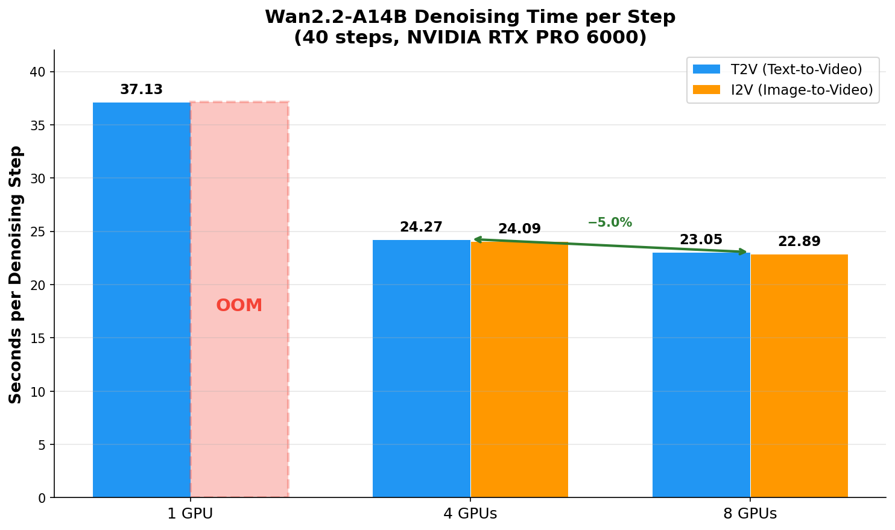
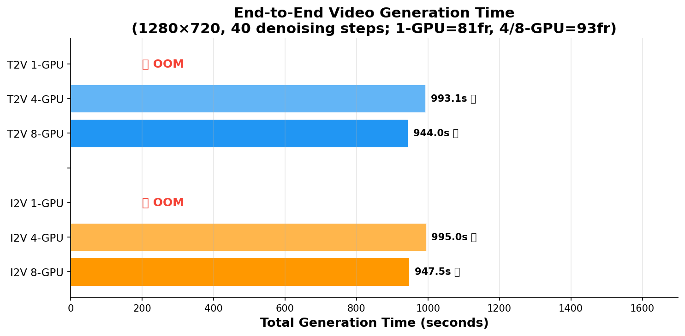
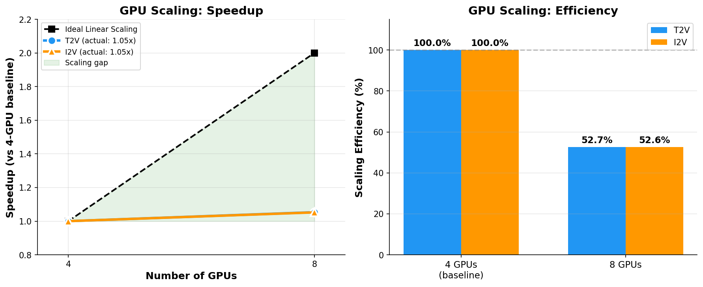
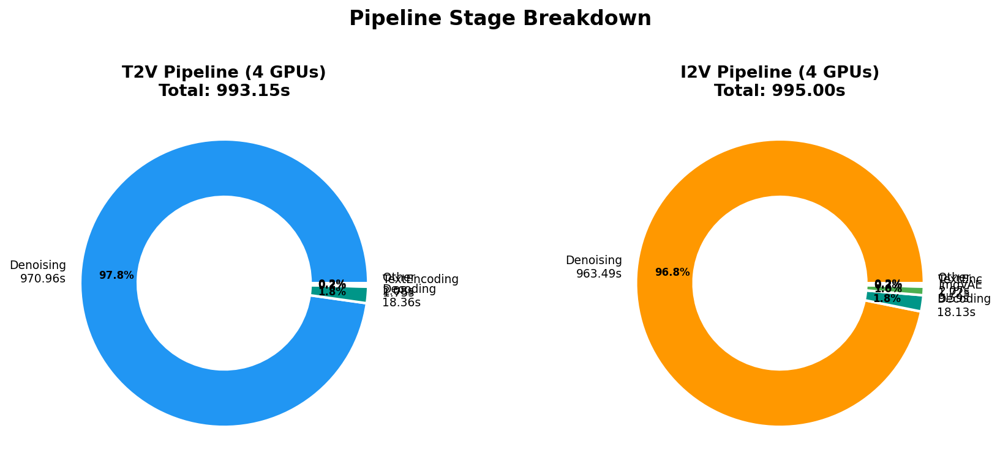
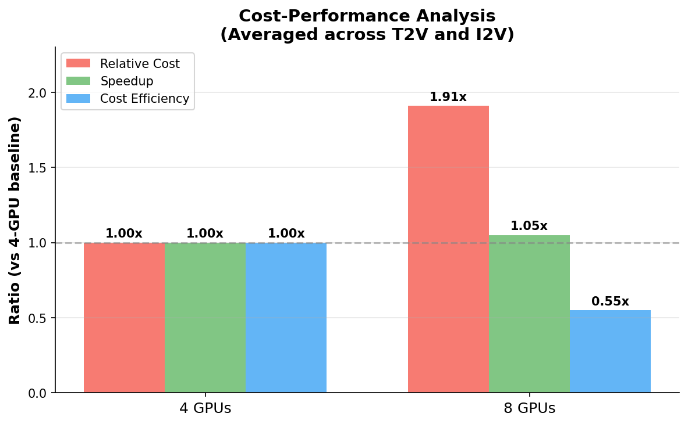
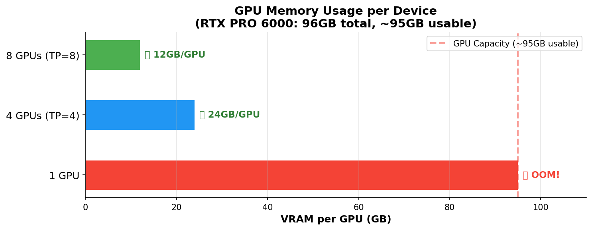

# Wan2.2 Video Generation Benchmark on NVIDIA RTX PRO 6000 (G4)

> **GPU Scaling Analysis**: Wan-AI/Wan2.2-A14B Text-to-Video & Image-to-Video inference with SGLang on Google Cloud G4 VMs (1, 4, 8 GPUs)

Based on the [Google AI-Hypercomputer GPU Recipe](https://github.com/AI-Hypercomputer/gpu-recipes/tree/main/inference/g4/wan2.2/sglang) — executed with the same SGLang commands, model paths, flags, and prompts, plus additional 8-GPU scaling tests.

> ⚠️ **Deviations from Recipe**: See [Deviations from Original Recipe](#deviations-from-original-recipe) section for differences between this benchmark and the original Google recipe.

---

## Key Results at a Glance

| Benchmark | GPUs | TP | Frames | Sec/Step | Denoising (s) | Total (s) | Status |
|-----------|------|----|--------|----------|---------------|-----------|--------|
| **T2V** | 1 | 1 | 81 | 37.13 | 1,485 | — | ❌ OOM at Decode |
| **T2V** | 4 | 4 | 93 | **24.27** | **971** | **993** | ✅ |
| **T2V** | 8 | 8 | 93 | **23.05** | **922** | **944** | ✅ |
| **I2V** | 1 | 1 | 81 | — | — | — | ❌ OOM |
| **I2V** | 4 | 4 | 93 | **24.09** | **963** | **995** | ✅ |
| **I2V** | 8 | 8 | 93 | **22.89** | **916** | **948** | ✅ |

**💡 Key Finding:** Going from 4→8 GPUs provides only **~5% speedup** due to PCIe interconnect overhead. **4 GPUs (TP=4) is the sweet spot** for cost-performance.

---

## Benchmark Visualizations

### Denoising Time per Step
The denoising stage runs 40 diffusion steps and dominates total generation time (~97%).



### Total End-to-End Generation Time
Complete video generation pipeline timing (model load → text encoding → denoising → VAE decode → save).



### GPU Scaling Efficiency
Scaling from 4→8 GPUs achieves only **1.05x speedup** (ideal would be 2.0x). The PCIe interconnect on G4 VMs creates a communication bottleneck for tensor parallelism beyond 4 GPUs.



### Pipeline Stage Breakdown
Denoising accounts for **97-98%** of total generation time. VAE decoding (~18s) and text encoding (~2s) are negligible.



### Cost-Performance Analysis
Using 8 GPUs costs **1.9x more** but provides only **1.05x speedup**, making the cost efficiency **0.55x** compared to the 4-GPU configuration.



### GPU Memory Analysis
Single GPU OOMs because the 14B model + activations exceed the 95GB usable VRAM. Multi-GPU TP distributes memory effectively.



---

## Hardware & Software

| Component | Specification |
|-----------|--------------|
| **Machine Type** | `g4-standard-384` |
| **GPUs** | 8× NVIDIA RTX PRO 6000 Blackwell |
| **GPU Memory** | 96 GB per GPU (768 GB total) |
| **Interconnect** | PCIe Gen5 (no NVLink) |
| **vCPUs** | 384 |
| **RAM** | ~384 GB |
| **CUDA** | 12.9.1 |
| **Driver** | 570.211.01 |
| **OS** | Ubuntu 24.04.4 LTS |
| **Framework** | SGLang (`lmsysorg/sglang:latest`) |
| **Models** | `Wan-AI/Wan2.2-T2V-A14B-Diffusers`, `Wan-AI/Wan2.2-I2V-A14B-Diffusers` |
| **Cloud** | Google Cloud Platform |
| **Zone** | europe-west4-b |
| **Project** | your-project-id |

---

## Detailed Results

### GPU Scaling (4 vs 8 GPUs)

| Metric | T2V 4-GPU | T2V 8-GPU | Δ | I2V 4-GPU | I2V 8-GPU | Δ |
|--------|-----------|-----------|---|-----------|-----------|---|
| Sec/Step | 24.27 | 23.05 | **-5.0%** | 24.09 | 22.89 | **-5.0%** |
| Denoising | 970.96s | 921.93s | **-5.1%** | 963.49s | 915.78s | **-5.0%** |
| Decode | 18.36s | 18.16s | -1.1% | 18.13s | 17.93s | -1.1% |
| **Total** | **993.15s** | **944.01s** | **-4.9%** | **995.00s** | **947.54s** | **-4.8%** |

### Pipeline Stage Timing (4 GPUs)

#### T2V (Text-to-Video)
| Stage | Time (s) | % |
|-------|----------|---|
| InputValidation | 0.000 | 0.0% |
| TextEncoding | 1.754 | 0.2% |
| LatentPreparation | 0.001 | 0.0% |
| TimestepPreparation | 0.000 | 0.0% |
| **Denoising** | **970.963** | **97.8%** |
| **Decoding** | **18.356** | **1.8%** |
| **Total** | **993.150** | **100%** |

#### I2V (Image-to-Video)
| Stage | Time (s) | % |
|-------|----------|---|
| InputValidation | 0.036 | 0.0% |
| TextEncoding | 1.721 | 0.2% |
| **ImageVAEEncoding** | **9.594** | **1.0%** |
| LatentPreparation | 0.001 | 0.0% |
| TimestepPreparation | 0.001 | 0.0% |
| **Denoising** | **963.494** | **96.8%** |
| **Decoding** | **18.126** | **1.8%** |
| **Total** | **995.000** | **100%** |

### 1-GPU OOM Details

| Model | Stage | VRAM Used | VRAM Capacity | Needed |
|-------|-------|-----------|---------------|--------|
| T2V | DecodingStage (after 1485s denoising) | 94.55 GB | 94.98 GB | +1.02 GB |
| I2V | Inference (at ImageVAEEncoding) | 94.11 GB | 94.98 GB | +1.97 GB |

Both OOM because the recipe disables all CPU offloading (`--dit-layerwise-offload false --vae-cpu-offload false`).

---

## Reproducing the Benchmarks

### One-Command End-to-End (Recommended)

The `scripts/run_all.sh` script automates everything: creates 2 G4 VMs, installs Docker + NVIDIA toolkit, pulls the SGLang image, runs all 6 benchmarks (T2V + I2V × 1/4/8 GPUs) in parallel on separate VMs, waits for completion, and collects full logs.

```bash
# Prerequisites: gcloud CLI authenticated, GPU quota for g4-standard-384
git clone https://github.com/MG-Cafe/wan2.2-rtx-pro-6000-benchmark.git
cd wan2.2-rtx-pro-6000-benchmark

export PROJECT_ID="your-project-id"
export ZONE="europe-west4-b"  # any zone with G4 capacity

bash scripts/run_all.sh
```

**What `run_all.sh` does (7 steps):**
1. Creates 2 G4 VMs (`g4-standard-384`, 8× RTX PRO 6000, 500GB disk)
2. Resizes filesystem to use full 500GB
3. Installs Docker + NVIDIA Container Toolkit on both VMs
4. Pulls `lmsysorg/sglang:latest` Docker image on both VMs
5. Runs T2V benchmarks (1/4/8 GPU) on VM1
6. Runs I2V benchmarks (1/4/8 GPU) on VM2
7. Polls for completion, collects full logs to `results/run_*/`

**Time estimate:** ~2 hours total (setup ~15 min, benchmarks ~1.5 hours)
**Cost estimate:** ~$50-80 for the full benchmark run (2× g4-standard-384 for ~2 hours)

### Manual Step-by-Step

If you prefer to run steps manually:

#### Step 1: Create a G4 VM

```bash
export PROJECT_ID="your-project-id"
export ZONE="europe-west4-b"

gcloud compute instances create g4-sglang-wan22 \
  --machine-type=g4-standard-384 \
  --project=${PROJECT_ID} \
  --zone=${ZONE} \
  --image-project=ubuntu-os-accelerator-images \
  --image-family=ubuntu-accelerator-2404-amd64-with-nvidia-570 \
  --maintenance-policy=TERMINATE \
  --boot-disk-size=500GB
```

#### Step 2: Setup Docker & NVIDIA Container Toolkit

```bash
# SSH into the VM
gcloud compute ssh g4-sglang-wan22 --project=${PROJECT_ID} --zone=${ZONE} --tunnel-through-iap

# Resize filesystem
sudo growpart /dev/nvme0n1 1
sudo resize2fs /dev/nvme0n1p1

# Run the setup script (see scripts/01_vm_setup.sh)
sudo bash scripts/01_vm_setup.sh
```

#### Step 3: Run Benchmarks

```bash
# Start SGLang container
sudo docker run -d \
  --name sglang-benchmarks \
  --gpus all \
  -v /scratch:/scratch \
  -v /scratch/cache:/root/.cache \
  --ipc=host \
  lmsysorg/sglang:latest \
  /bin/bash -c '/scratch/benchmark_script.sh 2>&1 | tee /scratch/output.log'
```

#### T2V 1-GPU (81 frames)
```bash
sglang generate --model-path Wan-AI/Wan2.2-T2V-A14B-Diffusers \
  --dit-layerwise-offload false --text-encoder-cpu-offload false \
  --vae-cpu-offload false --pin-cpu-memory --dit-cpu-offload false \
  --prompt "Summer beach vacation style, a white cat wearing sunglasses sits on a surfboard..." \
  --save-output --num-gpus 1 --num-frames 81
```

#### T2V 4-GPU (93 frames, TP=4)
```bash
sglang generate --model-path Wan-AI/Wan2.2-T2V-A14B-Diffusers \
  --dit-layerwise-offload false --text-encoder-cpu-offload false \
  --vae-cpu-offload false --pin-cpu-memory --dit-cpu-offload false \
  --prompt "Summer beach vacation style, a white cat wearing sunglasses sits on a surfboard..." \
  --save-output --num-gpus 4 --tp-size 4 --num-frames 93
```

#### T2V 8-GPU (93 frames, TP=8)
```bash
sglang generate --model-path Wan-AI/Wan2.2-T2V-A14B-Diffusers \
  --dit-layerwise-offload false --text-encoder-cpu-offload false \
  --vae-cpu-offload false --pin-cpu-memory --dit-cpu-offload false \
  --prompt "Summer beach vacation style, a white cat wearing sunglasses sits on a surfboard..." \
  --save-output --num-gpus 8 --tp-size 8 --num-frames 93
```

#### I2V 1-GPU (81 frames)
```bash
sglang generate --model-path Wan-AI/Wan2.2-I2V-A14B-Diffusers \
  --image-path assets/logo.png \
  --dit-layerwise-offload false --text-encoder-cpu-offload false \
  --vae-cpu-offload false --pin-cpu-memory --dit-cpu-offload false \
  --prompt "A curious raccoon" --save-output --num-gpus 1 --num-frames 81
```

#### I2V 4-GPU (93 frames, TP=4)
```bash
sglang generate --model-path Wan-AI/Wan2.2-I2V-A14B-Diffusers \
  --image-path assets/logo.png \
  --dit-layerwise-offload false --text-encoder-cpu-offload false \
  --vae-cpu-offload false --pin-cpu-memory --dit-cpu-offload false \
  --prompt "A curious raccoon" --save-output --num-gpus 4 --tp-size 4 --num-frames 93
```

#### I2V 8-GPU (93 frames, TP=8)
```bash
sglang generate --model-path Wan-AI/Wan2.2-I2V-A14B-Diffusers \
  --image-path assets/logo.png \
  --dit-layerwise-offload false --text-encoder-cpu-offload false \
  --vae-cpu-offload false --pin-cpu-memory --dit-cpu-offload false \
  --prompt "A curious raccoon" --save-output --num-gpus 8 --tp-size 8 --num-frames 93
```

### Step 4: Cleanup

```bash
gcloud compute instances delete g4-sglang-wan22 \
  --zone=${ZONE} --project=${PROJECT_ID} \
  --quiet --delete-disks=all
```

---

## Deviations from Original Recipe

The following changes were made from the [original Google recipe](https://github.com/AI-Hypercomputer/gpu-recipes/tree/main/inference/g4/wan2.2/sglang) for practical reasons:

| Aspect | Original Recipe | This Benchmark | Reason |
|--------|----------------|----------------|--------|
| **Boot disk** | 200 GB | 500 GB | 200GB was insufficient: 55GB Docker image + 30GB+ model weights + OS filled the disk |
| **Docker mode** | `docker run -it` (interactive) | `docker run -d` (detached) | Needed for automation via SSH with IAP tunnel (sessions timeout) |
| **Model pre-download** | `huggingface-cli download` of base models | Skipped | SGLang automatically downloads the `-Diffusers` variants it needs; base models are not used by the benchmark commands |
| **Filesystem resize** | Not mentioned | `growpart` + `resize2fs` required | Boot disk image is 10GB; partition must be grown to use full disk |
| **8-GPU tests** | Not in recipe | Added | Extended the recipe to test TP=8 for GPU scaling analysis |

**What is identical to the recipe:**
- All `sglang generate` commands, flags, prompts, and model paths (character-for-character match)
- Machine type: `g4-standard-384`
- Image: `ubuntu-accelerator-2404-amd64-with-nvidia-570`
- Docker image: `lmsysorg/sglang:latest`
- GPU configuration: `--gpus all`, `--ipc=host`
- Volume mounts: `/scratch:/scratch`, `/scratch/cache:/root/.cache`

**Note on default parameters:** The values `infer_steps=40`, `seed=42`, `guidance_scale=4.0` are SGLang defaults — they are not specified in the recipe and were not set by us. They appear in the SGLang `server_args` log output.

**Raw logs:** Partial raw SGLang output logs are preserved in `results/raw_logs/`. The 4-GPU and 1-GPU results were captured via direct SSH sessions (not background tasks) and are only available in the conversation history, not as separate log files.

---

## Key Findings & Recommendations

1. **4 GPUs (TP=4) is optimal** — best cost/performance ratio on G4 VMs
2. **8 GPUs provide minimal benefit** — only ~5% speedup for 2x the GPU cost due to PCIe bottleneck
3. **1-GPU requires offloading** — enable `--vae-cpu-offload true` to avoid OOM on single RTX PRO 6000
4. **Denoising dominates runtime** — 97%+ of generation time; optimizations should target this stage
5. **NVLink would help** — GPU interconnect is the bottleneck; NVLink-equipped systems (A100/H100) would likely show better 8-GPU scaling
6. **T2V ≈ I2V performance** — both models have nearly identical denoising speeds (<1% difference)

---

## Repository Structure

```
├── README.md                    # This file
├── generate_plots.py            # Python script to regenerate all plots
├── plots/
│   ├── 01_denoising_time_per_step.png
│   ├── 02_total_generation_time.png
│   ├── 03_gpu_scaling_efficiency.png
│   ├── 04_pipeline_breakdown.png
│   ├── 05_cost_performance.png
│   └── 06_memory_usage.png
├── scripts/
│   ├── run_all.sh               # ⭐ One-command end-to-end runner
│   ├── 01_vm_setup.sh           # VM Docker + NVIDIA setup
│   ├── 02_t2v_benchmarks.sh     # T2V 1-GPU & 4-GPU benchmarks
│   ├── 03_i2v_benchmarks.sh     # I2V 1-GPU & 4-GPU benchmarks
│   ├── 04_t2v_8gpu_benchmark.sh # T2V 8-GPU benchmark
│   └── 05_i2v_8gpu_benchmark.sh # I2V 8-GPU benchmark
└── results/
    ├── benchmark_data.json      # Raw benchmark data
    └── raw_logs/                # Partial raw SGLang output logs
        ├── 8gpu_t2v_i2v_results.log
        └── i2v_1gpu_oom_prior_session.log
```

---

## Regenerating Plots

```bash
pip install matplotlib numpy
python generate_plots.py
```

---

*Benchmarks run on April 20, 2026 on Google Cloud G4 VMs in europe-west4-b.*
